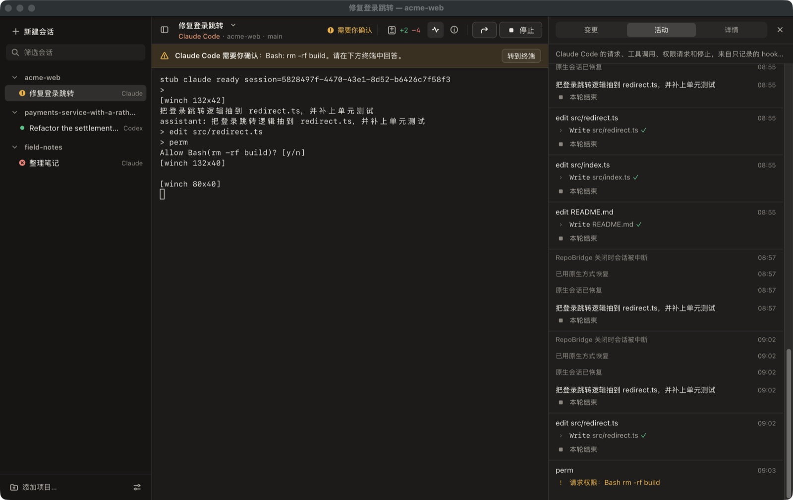

# RepoBridge 工作台：使用、界面、实现与验收

_2026-10-08，作者 Xuanyu CHAN。产品范围见 [PROJECT_PLAN.md](PROJECT_PLAN.md) v2.0。本文描述已实现的 W1–W3
内核、W5 界面重设计与缺陷修复、运行方式、证据等级和尚未完成的真实验收。_



## 运行

代码在分支 `claude/repobridge-product-direction-8e26f9`，已于 2026-10-08 经
[PR #1](https://github.com/CHANxuanyu/harness-bridge/pull/1) 合并到 GitHub 默认分支
`claude/new-repo-plan-dn1eac`（合并提交 `e348c85`）。本机开发检出位于 worktree
`/Users/chan/Downloads/harness-bridge/.claude/worktrees/repobridge-product-direction-8e26f9`；
`/Users/chan/Downloads/harness-bridge` 当前所在的 `local/glm-macos-validation`（`f2cd6e6`）不含这些代码，
在那里运行会得到 “Extra desktop is not defined / invalid choice: app”。

```bash
cd /Users/chan/Downloads/harness-bridge/.claude/worktrees/repobridge-product-direction-8e26f9 && uv sync --frozen --extra desktop && uv run --frozen --extra desktop hbridge app --help
uv run --frozen --extra desktop hbridge app             # 原生窗口（也可用 repobridge）
uv run --frozen --extra desktop hbridge app --browser   # 在默认浏览器中打开同一界面
```

- 从普通终端或 Finder 打开的终端启动，不要在另一个 agent 会话里启动：App 检测到 `CLAUDECODE` 或云 agent
  环境变量时拒绝启动原生会话。
- 同一个状态目录只允许一个 App 实例；第二次启动会提示“已在运行”并退出，避免两个窗口争夺同一批会话。
- 状态目录默认 `~/.local/state/harness-bridge`（`--state-dir` / `HBRIDGE_STATE_DIR`）；工作台数据在其中的
  `workbench.sqlite3` 与 `workbench/`（含 `prefs.json` 布局与外观偏好），与旧任务库分开。
- CLI 自动发现：`claude` 查 PATH、`~/.local/bin`、Homebrew；`codex` 还查找 ChatGPT/Codex 桌面 App 自带的 CLI。
- 关闭窗口先确认；关闭等同于关闭终端：会话进程结束，原生会话由各家 CLI 保存，下次可“恢复”。

## 界面

| 区域 | 内容 |
|---|---|
| 侧边栏（可拖动宽度、⌃⌘S 收起） | 顶部“新建会话”（⌘N）与筛选；项目分组（可折叠，折叠时显示待确认数）；会话一行：状态符号 + 标题 + harness；悬停显示归档；右键菜单。底部：添加项目、设置 |
| 工具栏 | 侧边栏开关；会话标题（点击重命名）+ 会话菜单；副标题 harness · 项目 · 分支；状态文字；变更计数（+/−，点开“变更”）；活动、详情；“交接”；唯一主操作（停止 / 恢复 / 启动 / 重新启动） |
| 提示条（仅在需要处理时） | 等待权限（转到终端）、失败（原因 + 恢复/重新启动 + 查看详情）、被中断（恢复）、遗留进程、找不到 CLI、项目文件夹丢失、连接断开 |
| 主区域 | 原生 CLI 终端（xterm.js），始终占最大连续空间；未运行时显示“上次运行的终端输出（只读）” |
| 辅助面板（默认关闭，⌘⇧D/⌘⇧A/⌘⇧I、⌘\ 关闭，可拖动宽度并记住） | 变更：文件列表 + 差异（自动打开第一个文件）；活动：按轮次的请求、工具、权限、停止；详情：会话、恢复（可复制原生恢复命令）、交接链、运行记录、折叠的技术详情 |
| 对话框 | 新建会话、添加项目（原生文件夹选择）、交接、设置（外观/终端配色/字号/显示已归档/CLI 检测）、快捷键 |

窄窗口：主区域放不下停靠的辅助面板（< 520 px）时面板改为浮层；窗口窄于 760 px 时侧边栏也改为浮层；
工具栏文字分两级收起（先收次要标签，再收全部标签），终端不被挤压。

更多截图（合成数据、stub CLI）：[浅色变更与差异](screenshots/after-light-changes.jpg)、
[浅色交接对话框](screenshots/after-light-handoff.jpg)、[深色失败与详情](screenshots/after-dark-failed-details.jpg)、
[首次打开](screenshots/after-light-welcome.jpg)、[窄窗口浮层](screenshots/after-dark-narrow-overlay.jpg)；
改版前：[原生窗口](screenshots/before-dark-overview.jpg)、[窄浏览器](screenshots/before-browser-narrow.jpg)。

### 设计原则（依据与取舍）

参考 Apple Human Interface Guidelines（Designing for macOS、Windows、Sidebars、Toolbars、Typography、
Materials、Accessibility）与 Claude Desktop Code 工作区（侧边栏会话 + 主工作区 + 按需窗格），提炼为：

- **内容优先**：终端是唯一长期占据大面积的内容；变更/活动/详情按需打开，可调宽、可关闭、记住状态。
- **两级导航**：项目 → 会话，最多两级；当前选择用整行底色，不用彩色大卡片。关键操作不放在侧边栏底部。
- **一个主操作**：工具栏尾部只有一个实心主按钮（恢复/启动）；“停止”是普通按钮并需确认；“归档”“移除项目”
  明确写“不删除原生历史和文件”，与“停止进程”“关闭面板”在措辞和图标上区分。
- **字体与层级**：系统字体，正文 13 px（macOS 默认），次要 11–12 px，最小 10.5 px；终端用 `ui-monospace`
  （SF Mono）。间距 4 px 网格；圆角 6（控件）/8（弹出层）/12（对话框）；以分隔线代替边框堆叠。
- **浅色与深色分别调色**：暖中性色，正文对比度 ≥ 4.5:1；浅色终端开启 xterm `minimumContrastRatio 4.5`，
  避免 TUI 的浅色前景在浅底上不可读；终端可设为“始终深色”。支持 `prefers-contrast: more`。
- **状态不只靠颜色**：每个状态都有形状 + 文字（工作中/等待输入/需要你确认/已停止/失败/已中断/遗留进程）。
- **诚实的材质**：侧边栏使用不透明的轻微色调，不用 CSS 模糊冒充 macOS 原生材质或 Liquid Glass。
- **动效克制**：120–160 ms 的弹出/淡入；`prefers-reduced-motion` 时全部关闭（加载指示保留静态形状）。
- **Mac 行为**：保留标准标题栏、红绿灯、拖动与缩放；窗口标题跟随“会话 — 项目”；菜单栏显示 RepoBridge；
  标题栏外观跟随 App 的 跟随系统/浅色/深色 设置。

## 原生窗口集成

- 页面 CSP 为 `script-src 'self'`（禁止 eval）。pywebview 的 JS 桥用 `new Function` 生成函数，会被 CSP 拦截，
  因此不使用 js_api；窗口标题、标题栏外观、文件夹选择走已认证的本地 API（`/api/native/*`），由 Python 直接调用
  窗口对象。这同时修复了此前原生窗口里“选择…”按钮不出现、标题不变的缺陷。
- 菜单栏名称在导入 pywebview 前设为 RepoBridge；窗口最小 880×560，默认 1360×860，关闭前确认。
- 开发验证（仅 `--dev-snapshot-dir`，帮助中隐藏）：写出启动链接供浏览器加入同一服务；`/api/dev/snapshot` 用
  WKWebView 快照和本进程窗口捕获生成 PNG（含标题栏）；`/api/dev/reload`（可带 `#dev=` 动作打开对话框）与
  `/api/dev/resize` 控制原生窗口。普通启动不存在这些路由。

## 实现结构

```text
src/harness_bridge/workbench/
  harness.py    CLI 发现、--version 探测、原生 argv、会话环境（去除 API/provider 变量）、嵌套/云环境拒绝
  relay.py      只记录的旁路：Claude hook stdin / Codex notify 参数 → 每次运行的 events.jsonl；永不输出、永远 exit 0
  pty_host.py   PTY 进程：受控终端、读写、resize、SIGHUP→TERM→KILL、进程组退出确认、输出缓冲/日志、OSC 9 解析
  store.py      workbench.sqlite3：projects / sessions / runs / events / handoffs；单写入名额在 BEGIN IMMEDIATE 中判定
  service.py    项目、会话、运行、旁路事件、阶段（工作中/等待输入）、权限提示、Git 变更、交接、reconcile、偏好、原生钩子
  prefs.py      外观与布局偏好（白名单校验，原子写入）
  changes.py    只读 git status / diff；不调用 git 的分支读取（用于每次状态推送）
  handoff.py    交接说明草稿（只用 App 观察到的事实 + 用户填写的进度）
  server.py     127.0.0.1 HTTP + SSE；令牌 cookie、Host/Origin/自定义头/JSON 校验、CSP；native/dev 路由
  native_mac.py 菜单栏名称、窗口外观、开发快照（PyObjC，可选）
  app.py        `hbridge app` / `repobridge`：单实例锁、pywebview 窗口或浏览器
  static/       index.html、app.css、app.js（无构建步骤）、vendor/xterm（MIT，未修改）
```

关键约定（W1–W3 起不变）：会话 = 一个原生会话名额；原生 ID 只用观察到的事实；同一真实工作目录只有一个
活动写入会话；App 重启后已不存在的运行标为“已中断”并可恢复；Codex 以 `--no-daemon` 运行并带本次进程有效的
notify/OSC 9 覆盖项；Claude 用 `--settings` 注入只记录的 hooks；会话环境去除 API/provider 变量（只记录名称）。

## W5 体验改进：发现并修复的问题

| 问题（实际使用中发现） | 修复 |
|---|---|
| 辅助面板常驻且隐藏时仍占 420 px 空列（内联 CSS 变量覆盖了隐藏规则） | 面板默认关闭；隐藏时列宽为 0；窄窗口改浮层 |
| 原生窗口里 pywebview JS 桥被 CSP 拦截：没有“选择…”文件夹按钮，窗口标题、外观不同步 | 改为本地 API + Python 调用窗口；保留严格 CSP |
| 打开对话框后焦点仍在终端，按键可能进入原生 CLI | 对话框获取焦点并限制 Tab；有弹出层时发往外部的按键被拦截 |
| 新建/恢复会话后终端不获得焦点（状态晚于请求返回） | 焦点意图保留到会话接入为止 |
| 每次状态更新都把焦点拉回终端、详情页反复重新请求 | 只在用户选择/启动时聚焦；详情按签名重绘 |
| 活动更新强制滚到底部 | 只在用户已在底部时跟随，否则显示“↓ 新活动” |
| 窄窗口里终端被压到 50×11、侧边栏和面板各占三分之一高度 | 侧边栏/面板浮层，终端保持全宽；工具栏标签分级收起 |
| 侧边栏每个项目重复三颗带框按钮，空状态重复 6 个大按钮，同屏多个实心主按钮 | 悬停/右键菜单；项目概览卡只给两个选择；同屏一个主操作 |
| 路径从左截断成无意义片段；技术字段（版本号、原生 ID、轮次）占据主界面 | `~` 缩写与中间省略；技术字段移入“详情 › 技术详情” |
| 状态只靠彩色徽章，多处重复（侧栏、会话栏、横幅、详情） | 形状 + 文字的统一状态符号；提示条只出现在需要处理时 |
| 新运行开始时向终端写入 App 自己的分隔线和结束标记 | 不再向原生输出插入内容；新运行清屏，只读状态用浮动提示说明 |
| 重命名、确认依赖浏览器 prompt/confirm | 工具栏就地重命名；锚定按钮的确认弹层（停止、归档、移除项目） |
| 两个 App 实例可同时管理同一状态目录 | 每个状态目录一个实例的文件锁 |
| 只有深色；浅色下终端可读性未考虑 | 浅色/深色独立配色、终端最低对比度、外观设置同步到原生标题栏 |
| 停止后再交接要分两步，容易忘记写入保护 | 交接对话框说明并可“停止原会话并创建” |

## 证据

| 等级 | 内容 | 结果 |
|---|---|---|
| T1 / T2-W | 工作台单元与集成测试（stub CLI，真实 PTY/子进程/Git/SQLite/回环 HTTP）：W1–W3 原有覆盖 + 偏好校验与持久化、阶段（Claude hooks / Codex notify）、native 与 dev 路由默认不存在、未启动创建、归档/取消归档、分支读取、单实例锁 | 36 项通过 |
| 原生窗口（真实像素） | pywebview 6.2.1 / WKWebView，在本机以 stub CLI 运行；通过本进程窗口捕获得到含标题栏的截图：深色主界面与权限等待、浅色变更与差异、浅色交接对话框、深色失败与详情、首次打开、900×640 浮层与关闭面板 | 通过（截图见上） |
| 浏览器（DOM 与操作） | 内置浏览器加入同一本地服务：添加项目错误/成功、⌘N 与项目占用说明、Esc、重命名、停止确认/取消、重新启动、恢复、焦点、设置对话框焦点与按键隔离、会话间输入归属、⌃Tab、筛选、⌘⇧D/⌘\、侧边栏浮层、归档/显示已归档/取消归档、项目菜单与移除、失败提示、2 万行输出、停止并交接 | 通过 |
| 重开一致性 | 多次重启 App：运行中会话变为“已中断”并可恢复；选中会话、面板、宽度、外观从偏好恢复 | 通过 |
| 未验证 | 真实 Claude Code / Codex 会话在新界面中的表现（T3-W/T4-W）；中文输入法组合输入、系统剪贴板复制粘贴、拖动调整宽度的真实指针操作、VoiceOver、浏览器模式下的 Safari/Firefox | 待你在本机或另行授权验证 |

## 真实验收步骤（W4，由你在本机执行）

在普通终端（不是 agent 会话）中运行上面的启动命令，然后：

1. 首次打开页面显示 Claude Code 与 Codex 的可用版本；添加一个小测试仓库。
2. 新建 Claude Code 会话：终端出现原生欢迎界面；状态从“正在启动”变为“等待输入”。
3. 发一条消息、让它改一个文件：状态变为“工作中”，工具栏出现 +/− 变更计数；遇到权限请求时出现提示条，
   在终端中回答后提示消失。试一次中文输入法、复制粘贴和 ⇧↩ 换行。
4. 点“停止”（确认）后点“恢复”：原生 CLI 回到同一会话历史。
5. 点“交接”到 Codex：可直接“停止原会话并创建”；新会话在同项目启动并读取说明。
6. 关闭窗口再打开：会话列表、选中项、面板布局和外观保持；被中断的会话可恢复。

任何一步失败，请把“详情”里的运行记录（退出码、失败原因、最后输出）发给我；这些不包含令牌。
