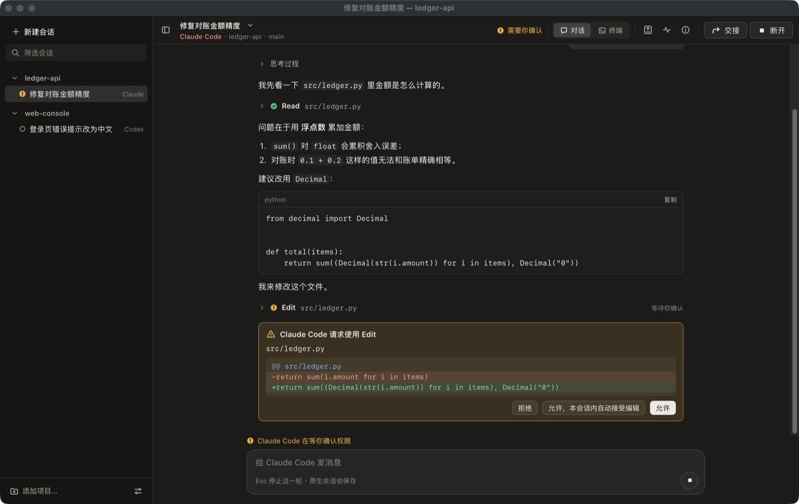

# RepoBridge 工作台：使用、界面、实现与验收

_2026-10-08，作者 Xuanyu CHAN。产品范围见 [PROJECT_PLAN.md](PROJECT_PLAN.md) v2.1。本文描述已实现的 W1–W3
内核、W5 界面重设计、W6 对话视图与视图切换、W7 官方桌面接续、运行方式、证据等级和尚未完成的真实验收。_



## 运行

代码在分支 `claude/repobridge-product-direction-8e26f9`，已于 2026-10-08 经
[PR #1](https://github.com/CHANxuanyu/harness-bridge/pull/1) 合并到 GitHub 默认分支
`claude/new-repo-plan-dn1eac`（合并提交 `e348c85`）。本机开发检出位于 worktree
`/Users/chan/Downloads/harness-bridge/.claude/worktrees/repobridge-product-direction-8e26f9`；
`/Users/chan/Downloads/harness-bridge` 当前所在的 `local/glm-macos-validation`（`f2cd6e6`）不含这些代码，
在那里运行会得到 “Extra desktop is not defined / invalid choice: app”。

```bash
cd /Users/chan/Downloads/harness-bridge/.claude/worktrees/repobridge-product-direction-8e26f9 && uv sync --frozen --extra desktop && uv run --frozen --extra desktop hbridge app --help
uv run --frozen --extra desktop hbridge app             # 原生窗口（也可用 repobridge）
uv run --frozen --extra desktop hbridge app --browser   # 在默认浏览器中打开同一界面
```

- 从普通终端或 Finder 打开的终端启动，不要在另一个 agent 会话里启动：App 检测到 `CLAUDECODE` 或云 agent
  环境变量时拒绝启动原生会话。
- 同一个状态目录只允许一个 App 实例；第二次启动会提示“已在运行”并退出，避免两个窗口争夺同一批会话。
- 状态目录默认 `~/.local/state/harness-bridge`（`--state-dir` / `HBRIDGE_STATE_DIR`）；工作台数据在其中的
  `workbench.sqlite3` 与 `workbench/`（含 `prefs.json` 布局与外观偏好），与旧任务库分开。
- CLI 自动发现：`claude` 查 PATH、`~/.local/bin`、Homebrew；`codex` 还查找 ChatGPT/Codex 桌面 App 自带的 CLI。
- 关闭窗口先确认；关闭等同于关闭终端：会话进程结束，原生会话由各家 CLI 保存，下次可“恢复”。
- 升级到 W6 版本：已经在运行的旧 App 不受影响（它的服务端代码已加载；但若重新载入窗口会拿到新的页面文件，
  部分新按钮会因旧服务端没有对应接口而报错）。退出旧 App 再启动即得到新版本；首次启动会把
  `workbench.sqlite3` 从 schema 1 升级到 2（只新增字段，已有会话保持终端视图），之后旧版本无法再打开该状态目录。

## 对话视图与终端视图（W6）

每个会话固定一种 harness；“对话 / 终端”只决定 RepoBridge 用哪种**原生**方式连接这同一个会话：

| 视图 | 连接方式 | 你看到的 |
|---|---|---|
| 终端 | 原生交互 CLI（`claude` / `codex`）运行在 App 自有 PTY 中 | 与在终端里运行完全相同；权限在终端中回答 |
| 对话 | Claude Code：`claude -p --input-format stream-json --output-format stream-json --verbose --include-partial-messages --replay-user-messages --permission-prompt-tool stdio`（官方 Agent SDK 使用的控制协议）。Codex：`codex app-server --listen stdio://`（官方 JSON-RPC，按本机 0.162.0-alpha.2 生成的 schema 核对） | 用户/助手消息分开；流式 Markdown、代码块（可复制）、表格；可折叠的思考过程、工具调用（输入/输出/错误/退出码/涉及文件 → 一键打开 diff）；权限卡片（允许 / 拒绝 / CLI 自己建议的“记住”选项，写明会记住什么）；每轮失败或中断的说明；状态行（连接中 / 工作中 N 秒 / 等你确认权限 / 已连接 · 模型 · 权限模式） |

- **只用原生结构化消息**：对话内容来自上述协议的事件；历史来自原生存储——Codex `thread/turns/list`
  （用一个不恢复线程、不开始新一轮的临时 app-server 读取），Claude Code 来自该会话自己的记录文件
  （`$CLAUDE_CONFIG_DIR/projects/*/<id>.jsonl`，也就是 `claude --resume` 读取的文件；只读，只读 RepoBridge
  创建的会话）。从不解析终端画面或清除 ANSI 来“拼”聊天记录。
- **登录与计费不变**：两种视图都运行你本机的 CLI 和它自己的登录；RepoBridge 不读取令牌、不注入 API key，
  去掉会切换到 API 计费的环境变量；不加 `--bare`、`--permission-mode`、跳过权限或沙箱的参数；Codex 要求刷新
  登录令牌时直接拒绝。权限模式、模型、审批策略都来自 CLI 自己的设置，并在状态行/详情里显示。
- **输入框**：↩ 发送、⇧↩ 换行；中文输入法组字时的 ↩ 不发送；草稿按会话保留；发送失败时文字退回输入框；
  一轮进行中发送键变为“停止这一轮”（Esc 同样），只中断这一轮、原生会话保留；工具栏的“断开”才结束连接进程。
- **不支持的不装作支持**：粘贴/拖入图片或文件会明确提示“暂不支持”；Codex 的 MCP 表单请求、交互式提问等
  RepoBridge 还不能回答的请求会被**可见地**拒绝并在对话里留下说明，而不是静默批准或吞掉。
- **长输出**：工具输出超过 200 KB 只显示开头并注明省略量；对话一次渲染最近 200 条，可“显示更早的”。

**切换视图 ≠ 换 harness。** 未连接时切换只是一个设置；已连接时：

1. 只在空闲点切换：对话视图中没有进行中的一轮/待确认权限；Claude 终端由 hook 判定“等待输入”；
   无法确认是否空闲（例如 Codex 终端）时要求你明确确认，否则拒绝并说明原因。
2. 结束原连接并**确认进程组已退出**（单写入约束在 SQLite 中保证，绝不同时有两个写入者）。
3. 用原生恢复接续同一个原生会话（Claude `--resume <id>`，Codex `thread/resume` / `codex resume <id>`）；
   还没说过话的会话则重新开始。切换本身不发送任何消息、不 fork、不复制文本冒充恢复。
4. 接续失败时如实提示“已结束原连接，但没能接续：原因”，原生会话仍可稍后恢复。

## 在官方桌面客户端中继续（W7）

| | Claude Code → Claude Desktop | Codex → Codex（ChatGPT App） |
|---|---|---|
| 入口 | 会话菜单 / 详情 ›“在 Claude Desktop 中打开…” | 会话菜单 / 详情 ›“在 Codex 中打开…” |
| 官方路径 | `claude --desktop --resume <session-id>`（Claude Code ≥ 2.1.285，macOS，订阅登录）；在无输入的 PTY 中运行，要求输出官方确认 `Opening session <id> in Claude Desktop` | 官方“已有对话”链接 `codex://threads/<thread-id>`，用 `open -a` 交给已安装的 App（按 bundle id `com.openai.codex` 与 `codex` URL scheme 识别） |
| 打开前 | 若会话正在 RepoBridge 中运行，先在空闲点结束这里的连接（Claude Code 不移交仍在别处打开的会话） | 同左 |
| 打开后 | 会话进入“已在 X 中打开”状态：侧栏和工具栏显示，提示条说明 RepoBridge 看不到那边是否仍在执行 | 同左 |
| 回到 RepoBridge | 发送/恢复前要求确认“那边已结束这一轮”，或点“回到 RepoBridge 继续”；然后用原生恢复接续同一 ID，历史可“刷新”读取那边新增的内容 | 同左 |
| 在终端里输入 `/desktop` | 从 Claude Code 自己的确认文字识别出移交，并自动进入同样的保护状态 | — |

RepoBridge 不改写厂商私有数据库、不伪造历史、不为在桌面侧栏“制造”记录而额外发送消息。**命令被接受只表示请求已送达；
“打开了正确的历史”“出现在官方侧栏/列表”“能在那边继续”“回来后历史连续”是需要分别观察的不同结果**（见下方矩阵）。

### 支持矩阵（2026-10-08）

| 组合 | 状态 |
|---|---|
| Claude Code · 终端视图（PTY） | 已实现；W1–W5 离线与原生窗口检查；真实 CLI 由你在 W4 中使用过 |
| Claude Code · 对话视图（stream-json） | 已实现；替身协议离线测试 + 原生窗口截图；**真实 CLI 未验证** |
| Codex · 终端视图（PTY） | 同 Claude 终端视图 |
| Codex · 对话视图（app-server） | 已实现；握手/建线程/命名/读取接口已用真实 0.162 app-server 在无凭据的隔离目录中核对（不发起任何一轮）；完整对话**真实未验证** |
| 终端 ⇄ 对话（同一原生会话） | 已实现并离线验证（不发消息、不双写、原生 ID 不变）；真实 CLI 未验证 |
| Claude → Claude Desktop 打开指定会话 | 已实现（官方命令 + 确认文字）；本机 Claude Code 2.1.291 满足版本要求；**真实打开与侧栏可见性未验证**（旧 Executor 证据不计入工作台） |
| Codex → Codex App 打开指定对话 | 已实现（官方链接）；**真实打开与侧栏可见性未验证**；app-server 新建线程的 `source` 为 `vscode`、`originator` 为 `repobridge`，官方 App 是否列出未知 |
| 桌面继续后回到 RepoBridge 的连续性 | 机制已实现（保护状态 + 原生恢复 + 历史刷新）；离线验证；**真实未验证** |
| 原生身份与历史在 App 重开后保持 | 已实现并离线验证（会话 ID、视图、桌面保护状态、历史读取） |
| 图片/文件附件 | 不支持（明确提示） |
| Codex 交互式提问、MCP 表单 | 不支持（可见地拒绝） |

## 界面

| 区域 | 内容 |
|---|---|
| 侧边栏（可拖动宽度、⌃⌘S 收起） | 顶部“新建会话”（⌘N）与筛选；项目分组（可折叠，折叠时显示待确认数）；会话一行：状态符号 + 标题 + harness；悬停显示归档；右键菜单。底部：添加项目、设置 |
| 工具栏 | 侧边栏开关；会话标题（点击重命名）+ 会话菜单；副标题 harness · 项目 · 分支；状态文字；“对话 / 终端”切换；变更计数（+/−，点开“变更”）；活动、详情；“交接”；唯一主操作（终端：停止 / 恢复 / 启动；对话：断开，未连接时输入框就是主操作） |
| 提示条（仅在需要处理时） | 等待权限（转到终端）、失败（原因 + 恢复/重新启动 + 查看详情）、被中断（恢复）、遗留进程、找不到 CLI、项目文件夹丢失、连接断开 |
| 主区域 | 终端视图：原生 CLI 终端（xterm.js），未运行时显示“上次运行的终端输出（只读）”；对话视图：消息列表 + 输入框（见上） |
| 辅助面板（默认关闭，⌘⇧D/⌘⇧A/⌘⇧I、⌘\ 关闭，可拖动宽度并记住） | 变更：文件列表 + 差异（自动打开第一个文件）；活动：按轮次的请求、工具、权限、停止；详情：会话、恢复（可复制原生恢复命令）、交接链、运行记录、折叠的技术详情 |
| 对话框 | 新建会话（harness + 界面：对话/终端，记住上次选择）、添加项目（原生文件夹选择）、交接、设置（外观/终端配色/字号/显示已归档/CLI 检测）、快捷键 |

窄窗口：主区域放不下停靠的辅助面板（< 520 px）时面板改为浮层；窗口窄于 760 px 时侧边栏也改为浮层；
工具栏文字分两级收起（先收次要标签，再收全部标签），终端不被挤压。

W6/W7 截图（原生窗口真实像素，合成项目 + 替身 CLI + 假的桌面 App）：
[浅色对话与 diff](screenshots/conv-light-conversation-changes.jpg)、
[Codex 命令审批与活动](screenshots/conv-dark-codex-approval-activity.jpg)、
[切换视图确认](screenshots/conv-dark-switch-view-confirm.jpg)、[切换后的终端（同一原生会话）](screenshots/conv-dark-terminal-after-switch.jpg)、
[在 Claude Desktop 中继续的确认](screenshots/conv-light-desktop-confirm.jpg)、[已在桌面打开的保护状态](screenshots/conv-light-desktop-hold.jpg)、
[新建会话选择界面](screenshots/conv-light-new-session-view.jpg)、[900×640 窄窗口](screenshots/conv-light-narrow-conversation.jpg)。

W5 截图（合成数据、stub CLI）：[浅色变更与差异](screenshots/after-light-changes.jpg)、
[浅色交接对话框](screenshots/after-light-handoff.jpg)、[深色失败与详情](screenshots/after-dark-failed-details.jpg)、
[首次打开](screenshots/after-light-welcome.jpg)、[窄窗口浮层](screenshots/after-dark-narrow-overlay.jpg)；
改版前：[原生窗口](screenshots/before-dark-overview.jpg)、[窄浏览器](screenshots/before-browser-narrow.jpg)。

### 设计原则（依据与取舍）

参考 Apple Human Interface Guidelines（Designing for macOS、Windows、Sidebars、Toolbars、Typography、
Materials、Accessibility）与 Claude Desktop Code 工作区（侧边栏会话 + 主工作区 + 按需窗格），提炼为：

- **内容优先**：终端是唯一长期占据大面积的内容；变更/活动/详情按需打开，可调宽、可关闭、记住状态。
- **两级导航**：项目 → 会话，最多两级；当前选择用整行底色，不用彩色大卡片。关键操作不放在侧边栏底部。
- **一个主操作**：工具栏尾部只有一个实心主按钮（恢复/启动）；“停止”是普通按钮并需确认；“归档”“移除项目”
  明确写“不删除原生历史和文件”，与“停止进程”“关闭面板”在措辞和图标上区分。
- **字体与层级**：系统字体，正文 13 px（macOS 默认），次要 11–12 px，最小 10.5 px；终端用 `ui-monospace`
  （SF Mono）。间距 4 px 网格；圆角 6（控件）/8（弹出层）/12（对话框）；以分隔线代替边框堆叠。
- **浅色与深色分别调色**：暖中性色，正文对比度 ≥ 4.5:1；浅色终端开启 xterm `minimumContrastRatio 4.5`，
  避免 TUI 的浅色前景在浅底上不可读；终端可设为“始终深色”。支持 `prefers-contrast: more`。
- **状态不只靠颜色**：每个状态都有形状 + 文字（工作中/等待输入/需要你确认/已停止/失败/已中断/遗留进程）。
- **诚实的材质**：侧边栏使用不透明的轻微色调，不用 CSS 模糊冒充 macOS 原生材质或 Liquid Glass。
- **动效克制**：120–160 ms 的弹出/淡入；`prefers-reduced-motion` 时全部关闭（加载指示保留静态形状）。
- **Mac 行为**：保留标准标题栏、红绿灯、拖动与缩放；窗口标题跟随“会话 — 项目”；菜单栏显示 RepoBridge；
  标题栏外观跟随 App 的 跟随系统/浅色/深色 设置。

## 原生窗口集成

- 页面 CSP 为 `script-src 'self'`（禁止 eval）。pywebview 的 JS 桥用 `new Function` 生成函数，会被 CSP 拦截，
  因此不使用 js_api；窗口标题、标题栏外观、文件夹选择走已认证的本地 API（`/api/native/*`），由 Python 直接调用
  窗口对象。这同时修复了此前原生窗口里“选择…”按钮不出现、标题不变的缺陷。
- 菜单栏名称在导入 pywebview 前设为 RepoBridge；窗口最小 880×560，默认 1360×860，关闭前确认。
- 开发验证（仅 `--dev-snapshot-dir`，帮助中隐藏）：写出启动链接供浏览器加入同一服务；`/api/dev/snapshot` 用
  WKWebView 快照和本进程窗口捕获生成 PNG（含标题栏）；`/api/dev/reload`（可带 `#dev=` 动作打开对话框）与
  `/api/dev/resize` 控制原生窗口。普通启动不存在这些路由。

## 实现结构

```text
src/harness_bridge/workbench/
  harness.py    CLI 发现、--version 探测、原生 argv、会话环境（去除 API/provider 变量）、嵌套/云环境拒绝
  structured.py 对话视图的原生结构化连接：Claude stream-json 控制协议、Codex app-server JSON-RPC、历史读取
  conversation.py 对话模型：把原生消息/通知/服务端请求翻译成条目（消息、工具、权限、轮次结束、说明）
  desktop_apps.py 官方桌面客户端识别与打开（claude --desktop --resume / codex://threads/）
  relay.py      只记录的旁路：Claude hook stdin / Codex notify 参数 → 每次运行的 events.jsonl；永不输出、永远 exit 0
  pty_host.py   PTY 进程：受控终端、读写、resize、SIGHUP→TERM→KILL、进程组退出确认、输出缓冲/日志、OSC 9 解析
  store.py      workbench.sqlite3（schema 2：会话视图、外部打开保护、运行的连接方式）；单写入名额在 BEGIN IMMEDIATE 中判定
  service.py    项目、会话、运行、旁路事件、阶段（工作中/等待输入）、权限提示、Git 变更、交接、reconcile、偏好、原生钩子
  prefs.py      外观与布局偏好（白名单校验，原子写入）
  changes.py    只读 git status / diff；不调用 git 的分支读取（用于每次状态推送）
  handoff.py    交接说明草稿（只用 App 观察到的事实 + 用户填写的进度）
  server.py     127.0.0.1 HTTP + SSE；令牌 cookie、Host/Origin/自定义头/JSON 校验、CSP；native/dev 路由
  native_mac.py 菜单栏名称、窗口外观、开发快照（PyObjC，可选）
  app.py        `hbridge app` / `repobridge`：单实例锁、pywebview 窗口或浏览器
  static/       index.html、app.css、app.js、markdown.js（只用 DOM 节点渲染，不用 innerHTML）、vendor/xterm（MIT，未修改）
```

关键约定（W1–W3 起不变）：会话 = 一个原生会话名额；原生 ID 只用观察到的事实；同一真实工作目录只有一个
活动写入会话；App 重启后已不存在的运行标为“已中断”并可恢复；Codex 以 `--no-daemon` 运行并带本次进程有效的
notify/OSC 9 覆盖项；Claude 用 `--settings` 注入只记录的 hooks；会话环境去除 API/provider 变量（只记录名称）。

## W5 体验改进：发现并修复的问题

| 问题（实际使用中发现） | 修复 |
|---|---|
| 辅助面板常驻且隐藏时仍占 420 px 空列（内联 CSS 变量覆盖了隐藏规则） | 面板默认关闭；隐藏时列宽为 0；窄窗口改浮层 |
| 原生窗口里 pywebview JS 桥被 CSP 拦截：没有“选择…”文件夹按钮，窗口标题、外观不同步 | 改为本地 API + Python 调用窗口；保留严格 CSP |
| 打开对话框后焦点仍在终端，按键可能进入原生 CLI | 对话框获取焦点并限制 Tab；有弹出层时发往外部的按键被拦截 |
| 新建/恢复会话后终端不获得焦点（状态晚于请求返回） | 焦点意图保留到会话接入为止 |
| 每次状态更新都把焦点拉回终端、详情页反复重新请求 | 只在用户选择/启动时聚焦；详情按签名重绘 |
| 活动更新强制滚到底部 | 只在用户已在底部时跟随，否则显示“↓ 新活动” |
| 窄窗口里终端被压到 50×11、侧边栏和面板各占三分之一高度 | 侧边栏/面板浮层，终端保持全宽；工具栏标签分级收起 |
| 侧边栏每个项目重复三颗带框按钮，空状态重复 6 个大按钮，同屏多个实心主按钮 | 悬停/右键菜单；项目概览卡只给两个选择；同屏一个主操作 |
| 路径从左截断成无意义片段；技术字段（版本号、原生 ID、轮次）占据主界面 | `~` 缩写与中间省略；技术字段移入“详情 › 技术详情” |
| 状态只靠彩色徽章，多处重复（侧栏、会话栏、横幅、详情） | 形状 + 文字的统一状态符号；提示条只出现在需要处理时 |
| 新运行开始时向终端写入 App 自己的分隔线和结束标记 | 不再向原生输出插入内容；新运行清屏，只读状态用浮动提示说明 |
| 重命名、确认依赖浏览器 prompt/confirm | 工具栏就地重命名；锚定按钮的确认弹层（停止、归档、移除项目） |
| 两个 App 实例可同时管理同一状态目录 | 每个状态目录一个实例的文件锁 |
| 只有深色；浅色下终端可读性未考虑 | 浅色/深色独立配色、终端最低对比度、外观设置同步到原生标题栏 |
| 停止后再交接要分两步，容易忘记写入保护 | 交接对话框说明并可“停止原会话并创建” |

## W6/W7 中发现并修复的问题

| 问题 | 修复 |
|---|---|
| `[hidden]` 被按钮的 `display` 覆盖，“↓ 新消息”在底部时也显示 | 全局 `[hidden]{display:none!important}` |
| 工具标题用绝对路径，200 字符截断后丢了扩展名 | 显示为相对项目的路径；标题上限放宽 |
| 从工具里点文件打不开 diff（原生给绝对路径，变更列表是相对路径） | 服务端返回相对路径，界面统一使用 |
| 权限卡片对 Edit 只显示 JSON；“允许并记住”不说明记住什么 | Edit/Write 显示 −/+ 差异；按 Claude Code 自己的建议写明“本会话自动接受编辑 / 始终允许 Bash(…)” |
| 被你拒绝的工具在活动里显示为“失败” | 区分“已拒绝”与“失败”（两种 harness） |
| 新的权限卡片样式名与活动时间线冲突，时间线里出现大号警示框 | 卡片改名 `.perm-card` |
| 原生恢复失败只显示“退出码 1” | 失败原因带上 CLI 自己的最后一行（如 “No conversation found …”）；未送达的消息标为“没有发送成功” |
| 窄工具栏把会话标题挤成两个字 | 紧凑宽度下状态文字收起（符号与侧栏仍显示），标题保留最小宽度 |
| 开发截图：原生窗口被其他窗口完全遮住时 WebKit 暂停页面，截图停在旧画面 | 仅开发截图模式关闭遮挡检测与 App Nap；不在普通启动中生效 |
| 测试实例可能“打开”真实的 Claude/Codex App | 开发参数 `--dev-app-dir` / `--dev-opener`：测试实例只识别假的 App 包、打开请求只被记录 |

## 证据

| 等级 | 内容 | 结果 |
|---|---|---|
| T1 / T2-W | 工作台单元与集成测试（stub CLI，真实 PTY/子进程/Git/SQLite/回环 HTTP）：W1–W3 原有覆盖 + 偏好校验与持久化、阶段（Claude hooks / Codex notify）、native 与 dev 路由默认不存在、未启动创建、归档/取消归档、分支读取、单实例锁 | 36 项通过 |
| 原生窗口（真实像素） | pywebview 6.2.1 / WKWebView，在本机以 stub CLI 运行；通过本进程窗口捕获得到含标题栏的截图：深色主界面与权限等待、浅色变更与差异、浅色交接对话框、深色失败与详情、首次打开、900×640 浮层与关闭面板 | 通过（截图见上） |
| 浏览器（DOM 与操作） | 内置浏览器加入同一本地服务：添加项目错误/成功、⌘N 与项目占用说明、Esc、重命名、停止确认/取消、重新启动、恢复、焦点、设置对话框焦点与按键隔离、会话间输入归属、⌃Tab、筛选、⌘⇧D/⌘\、侧边栏浮层、归档/显示已归档/取消归档、项目菜单与移除、失败提示、2 万行输出、停止并交接 | 通过 |
| 重开一致性 | 多次重启 App：运行中会话变为“已中断”并可恢复；选中会话、面板、宽度、外观从偏好恢复 | 通过 |
| T1 / T2-W（W6/W7） | 新增 22 项（工作台共 58 项）：Claude stream-json（流式、允许/拒绝/记住、提问、中断、登录失败、重试提示）、Codex app-server（文件/命令审批、拒绝、不支持请求的可见拒绝、失败轮次、重开后经 app-server 读取历史并恢复同一线程）、终端⇄对话切换（同一原生 ID、不发消息、单写入、忙时拒绝、无法确认空闲时需确认）、桌面打开（先释放、PTY 确认、保护状态跨重开、确认后接续、Codex 链接）、`/desktop` 识别、恢复失败说明、schema 1→2 迁移、HTTP/SSE 路由 | 通过（替身 CLI） |
| 协议核对（真实二进制，无模型） | 本机 `codex app-server` 0.162.0-alpha.2：生成官方 JSON schema；在隔离、无凭据的 `CODEX_HOME` 中完成 initialize、thread/start、thread/name/set、thread/resume、thread/turns/list（未物化时的错误）、thread/list——**没有发起任何一轮**。Claude Code 2.1.291：`--help` 列出 stream-json、`--permission-prompts`、`--desktop` 等参数；二进制包含 `can_use_tool` / `control_request` 协议字符串 | 通过（仅接口形状） |
| 原生窗口（W6/W7） | 深色对话 + Edit 权限卡片、浅色对话 + diff、Codex 命令审批 + 活动、切换视图确认、切换后的终端、Claude Desktop 打开确认与保护状态、新建会话界面选择、900×640 窄窗口 | 通过（截图见上） |
| 浏览器（W6） | 真实点击“允许”、展开工具、点文件打开 diff、发送/停止这一轮、拒绝命令、输入法组字时 ↩ 不发送、⇧↩ 不发送、↩ 发送并清空 | 通过 |
| 未验证 | 真实 Claude Code / Codex 在对话视图中的完整一轮、真实视图切换、真实官方桌面打开/侧栏可见/桌面继续后回来（需要你的授权，见 STATUS）；真实中文输入法、系统剪贴板、拖动调宽、VoiceOver、Safari/Firefox | 待验证 |

## 真实验收步骤（W4，由你在本机执行）

在普通终端（不是 agent 会话）中运行上面的启动命令，然后：

1. 首次打开页面显示 Claude Code 与 Codex 的可用版本；添加一个小测试仓库。
2. 新建 Claude Code 会话：终端出现原生欢迎界面；状态从“正在启动”变为“等待输入”。
3. 发一条消息、让它改一个文件：状态变为“工作中”，工具栏出现 +/− 变更计数；遇到权限请求时出现提示条，
   在终端中回答后提示消失。试一次中文输入法、复制粘贴和 ⇧↩ 换行。
4. 点“停止”（确认）后点“恢复”：原生 CLI 回到同一会话历史。
5. 点“交接”到 Codex：可直接“停止原会话并创建”；新会话在同项目启动并读取说明。
6. 关闭窗口再打开：会话列表、选中项、面板布局和外观保持；被中断的会话可恢复。

任何一步失败，请把“详情”里的运行记录（退出码、失败原因、最后输出）发给我；这些不包含令牌。

### W6/W7 真实验收（对话视图与官方桌面）

在测试仓库中，各 harness 各做一遍（每步都只在你点击时发生）：

1. 新建会话时选“对话”。发一条简短消息：看到流式回复；状态行显示模型与权限模式。
2. 让它修改一个文件：出现权限卡片；分别试“拒绝”和“允许”；变更计数与 diff 更新。
3. 一轮进行中点“停止这一轮”：这一轮显示“已停止”，会话仍连接。
4. 切到“终端”：确认弹层 → 原生 CLI 用 `--resume` / `codex resume` 回到同一会话（详情里原生 ID 不变）；
   再切回“对话”，历史仍在。
5. 会话菜单 →“在 Claude Desktop / Codex 中打开”：记录四件事——App 是否打开、是否是这条历史、
   是否出现在官方侧栏/列表、能否在那边继续发一条消息。
6. 回到 RepoBridge，“回到 RepoBridge 继续”→“刷新”：能看到在桌面端新增的内容；再发一条消息，原生 ID 不变。
7. 关闭并重开 RepoBridge：视图、历史、桌面保护状态仍在。
